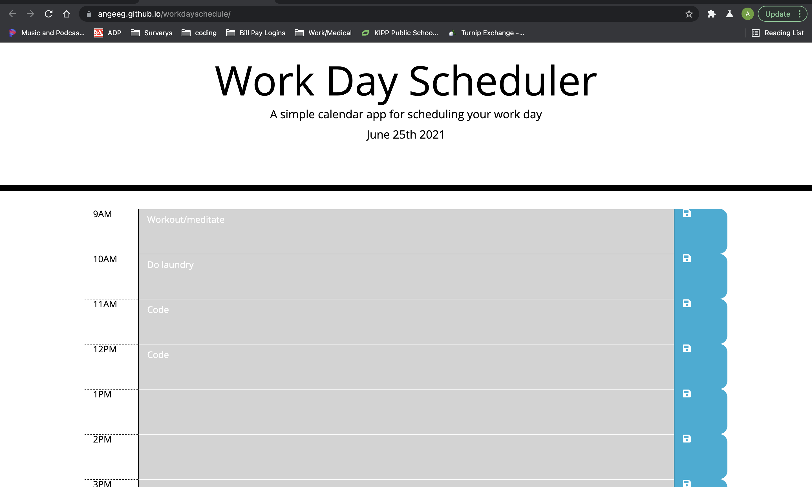

# Work Day Scheduler Starter Code

## Description 
This workday scheduler was designed to give the user a clean and simple website they can keep track of their schedule on. The color of the hour will change depending on what time it is, to give the user an idea if they're running on schedule or not. 
The user's tasks will be saved on the webpage, even if refreshed, until they either delete or update their task. 

## Installation
1. Open your machine's terminal and navigate to the directory you want to save the application in.
2. Clone <a href="https://github.com/angeeg/workdayschedule.git">this</a> repo in the command line.
3. Open the cloned repo in your code editor. 
4. Navigate to the index.html file, right click, and select "Open with Default Browser" to open the application. 
## Usage 
This this workday schedule to manage your daily tasks by the hour. Input tasks in each hour block and click the save button to the right. They will stay present until you delete or replace them. As real time approaches the time on schedule, the color scheme will change to give you a visual indication if you're running on time or not. 

## Credit 
This code began with <a href="https://github.com/coding-boot-camp/super-disco.git">this starter code</a> and was completed by <a href="https://github.com/angeeg">angeeg</a>.

### Technologies/Concepts Used:
* HTML
* CSS
* JS
* Third-Party APIs

## Questions
If you have any questions or run into any issues with the website please contact <a href="https://github.com/angeeg">angeeg</a>.